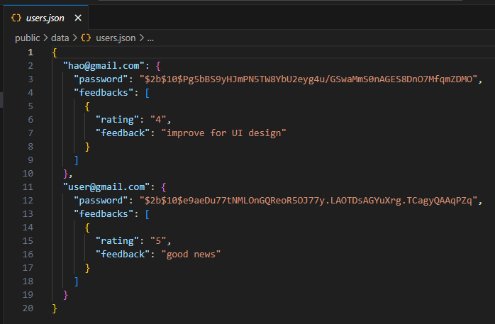

# HaoHaoNews Website using HTML, CSS and Javascript

Creating a News Website using HTML, CSS, and JavaScript is a project for my project website development.

Website: https://haohaonews.onrender.com

This project provides practical experience in working with APIs, handling DOM manipulation, and creating a responsive layout. By incorporating these fundamental web technologies, developers can gain a comprehensive understanding of building a functional News Website from scratch. It's an ideal learning opportunity for those looking to hone their skills web development.

Also than, I also using node.js with json database to managed user information for login and sign up. They admin can see full list for user and can delete user.

Reference:
- Youtube Tutorial Link: https://youtu.be/vd0buCxrhvo
- Github Link: https://github.com/constgenius/NewsWebsite

